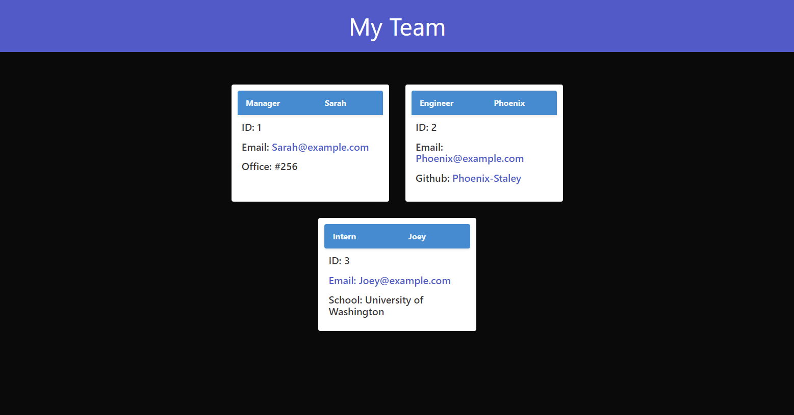

# HTML Generator - Team Viewer
  

  ## Description

  This application uses node.js, inquirer, jest, and bulma to create an easy, simple user experience in a command prompt. It asks the user questions about their team, and creates an HTML file to easily display the team's information. To make sure the user can add as many employees as their team has, this program uses a small amount of recursion. To ensure all functions happen in the correct order, even with the variability in user response time, this program utilizes promises to create asyncronous functions.
  The end result of this app looks like the webpage below.
  
  
  ## Table of contents
  
  1. [Installation](#installation)
  2. [Usage](#usage)
  3. [Tests](#tests)
  4. [Contribution](#contribution)
  5. [License](#license)
  6. [Questions](#questions)
  
  ## Installation
  
  To install this service, clone the Github repository at https://github.com/Phoenix-Staley/HTMLGenerator to your local machine. After this, install all the program's dependencies using `npm i` in the HTMLGenerator directory. To use this service, you must have Node.js version 16.0 or later installed. 
  
  ## Usage
  
  You must then open a terminal in the HTMLGenerator directory and run the command `npm i` to install all the dependencies. The video below demonstrates how to use this program after you have it fully installed.

  
  
  ## Tests
  
  To run the tests for this program, open a terminal and navigate to the HTMLGenerator directory. After this, simply run `npm run test`. These tests make sure all the classes are declared and functioning properly.
  
  ## Contribution
  
  If you would like to contribute, please contact me. My contact information is in the [Questions](#questions) section of this README.

  ## License

  Copyright (c) 2022 Phoenix Staley

      Permission is hereby granted, free of charge, to any person obtaining
      a copy of this software and associated documentation files (the
      "Software"), to deal in the Software without restriction, including
      without limitation the rights to use, copy, modify, merge, publish,
      distribute, sublicense, and/or sell copies of the Software, and to
      permit persons to whom the Software is furnished to do so, subject to
      the following conditions:
      
      The above copyright notice and this permission notice shall be
      included in all copies or substantial portions of the Software.
      
      THE SOFTWARE IS PROVIDED "AS IS", WITHOUT WARRANTY OF ANY KIND,
      EXPRESS OR IMPLIED, INCLUDING BUT NOT LIMITED TO THE WARRANTIES OF
      MERCHANTABILITY, FITNESS FOR A PARTICULAR PURPOSE AND
      NONINFRINGEMENT. IN NO EVENT SHALL THE AUTHORS OR COPYRIGHT HOLDERS BE
      LIABLE FOR ANY CLAIM, DAMAGES OR OTHER LIABILITY, WHETHER IN AN ACTION
      OF CONTRACT, TORT OR OTHERWISE, ARISING FROM, OUT OF OR IN CONNECTION
      WITH THE SOFTWARE OR THE USE OR OTHER DEALINGS IN THE SOFTWARE.
  
  ## Questions
  
  If you have a question or want to report a bug, you can email the developers [here](mailto:PhoenixStaley_Developer@outlook.com).
  This code was created by Phoenix Staley. To see more work by them, check out their [Github profile](https://github.com/Phoenix-Staley).